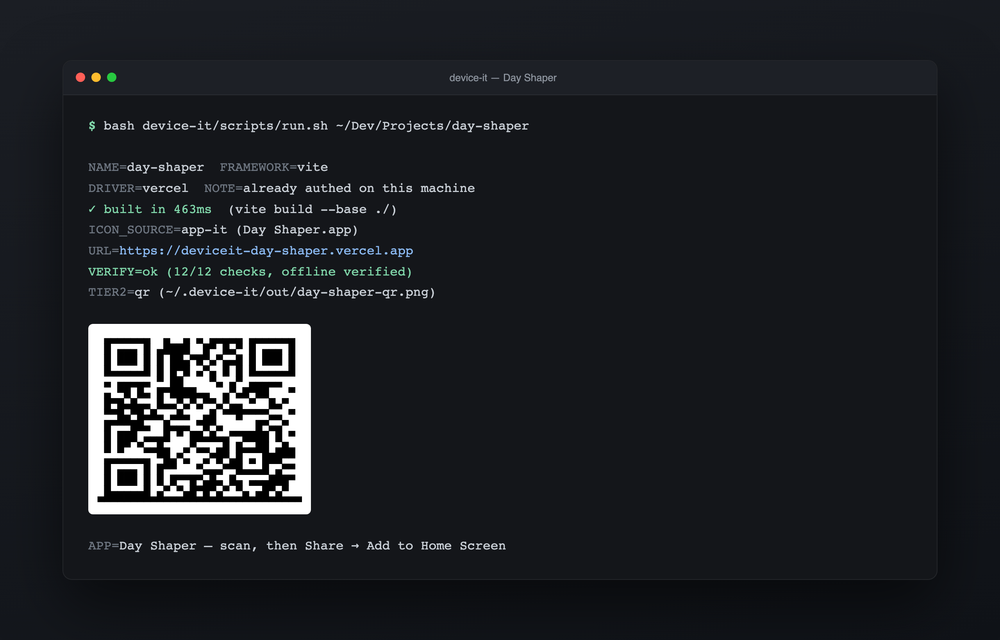
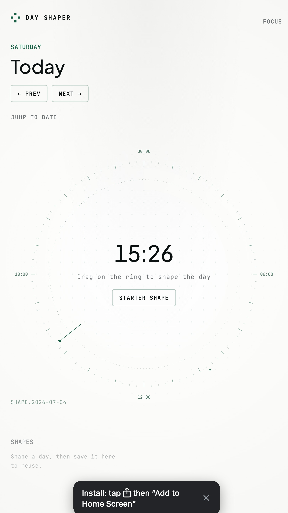

# device-it

**Turn a local web project into an installable, fullscreen, offline-capable app on your phone, tablet, or desktop — with one command from Claude Code or Codex.**

<!-- ═══════════════════════════════════════════════════════════════════════
     DEMO GIF PLACEHOLDER
     Replace this comment block with the demo GIF when it's ready:

     
     ═══════════════════════════════════════════════════════════════════════ -->



*Real, unedited output of one run: inspect → build → PWA transform → deploy → verify (12/12 checks, offline reload included) → a scannable install QR. The icon was lifted automatically from the project's Mac app.*

**Status:** working end-to-end on real projects. Young project, public since July 2026 — the QR/link lane is exercised daily; the Apple zero-touch lane and the authed-Netlify driver are code-complete with fewer miles on them. Runs on macOS (full) and Linux (QR lane); Windows via WSL.

Want to feel the result before installing anything? This app was produced by device-it — open it on your phone and add it to your Home Screen: **[deviceit-dice.vercel.app](https://deviceit-dice.vercel.app)**

## How it works

```
 your project
      │   inspect ······ framework, build command, icon candidates, backend smells
      ▼
    build ·············· vite build --base ./        (your source is never modified)
      ▼
  PWA transform ········ manifest + icon set + service worker  →  fullscreen, offline
      ▼
    deploy ············· auto-picks whatever you're already logged into:
      │                  vercel · netlify · cloudflare pages · github pages
      │                  nothing authed? → anonymous deploy, claim it in one click
      ▼
    install ──┬───────── QR / link · any device · about two taps
              └───────── pocket MDM · Apple devices · zero taps (one-time setup)
```

The transform happens on the **built output only** — device-it never edits your source tree. Re-running on the same project updates the same URL in place; the installed app picks up the new build on next launch.

## Install

**Claude Code** — clone as a personal skill:

```bash
git clone https://github.com/Christian-Katzmann/device-it ~/.claude/skills/device-it
```

Then, in any session: *"/device-it — put this project on my phone."*

**Codex** — the repo ships a `.codex-plugin` manifest; register it with your plugin setup, e.g.:

```bash
git clone https://github.com/Christian-Katzmann/device-it ~/plugins/device-it
codex plugin add device-it@personal
```

**No agent at all** — the pipeline is plain scripts:

```bash
bash device-it/scripts/run.sh /path/to/your/project --icon logo.png
bash device-it/scripts/run.sh --url https://already-hosted.app --name "Name"   # wrap an existing site
bash device-it/scripts/run.sh remove <slug>
```

Requirements: Node 18+, git, and ImageMagick (`magick`) on Linux — macOS can fall back to the built-in `sips`. A deploy account is *not* required (see below).

## The two install lanes

| | QR / link lane | Pocket-MDM lane |
|---|---|---|
| Devices | iPhone, iPad, Android, desktop Chrome/Edge | Apple devices |
| Effort per app | scan the QR, then 1–2 taps | none — the icon just appears |
| Accounts | none needed | free, self-hosted (one-time ~10 min setup) |
| Uninstall | delete the icon | zero-touch remove, too |

The pocket MDM is a tiny [nanomdm](https://github.com/micromdm/nanomdm) that runs **on your own machine, only while installing**, reached through a Tailscale Funnel, with a free Apple push certificate. No subscription, no hosted service, no data leaving your machine — the full setup walkthrough is in [`references/onboarding.md`](references/onboarding.md).

## Deploying without any account

If no hosting CLI is authed, device-it uses Netlify's anonymous deploy: your app is live on HTTPS in about a minute, **claimable for 60 minutes** — one click (GitHub SSO) makes it permanently yours, free. device-it opens the claim page on your computer, bakes a claim banner into the app itself, and tells you the temporary password the site carries until it's claimed. If the hour passes unclaimed, the site is deleted — device-it says this out loud rather than letting the app die quietly.



*Every build ships with an on-page install hint — shown only in the device's browser, never inside the installed app. Android and desktop get their browser's native install prompt instead.*

## What this is not

- **Not a native-app compiler.** No Xcode, no signing, no App Store. Apps are installed PWAs / managed web clips. If you need deep native APIs, this is the wrong tool — deliberately.
- **Not a hosting service.** Deploys go to *your* accounts (or a claimable anonymous site). A public URL means a public app; device-it won't add a login wall, because auth walls break offline.
- **Not an Android MDM.** Zero-touch push rides Apple's MDM protocol. Android and desktop always use the QR/link lane — which there is a *one-tap* native install, so little is lost.

## Honest limits

- Offline starts after the **first launch** — that's when the service worker caches. Nothing can launch the app for you.
- Apps with real backends: the shell works offline, API calls still need their server.
- The Apple lane needs a yearly ~3-minute push-certificate renewal (the built-in `doctor` warns 30 days ahead).
- Anonymous deploys have a per-machine daily quota — one login to any supported host removes it.

## Under the hood

- [`SKILL.md`](SKILL.md) — the agent-facing contract (what an agent does, verbatim)
- [`references/hosting.md`](references/hosting.md) — the deploy-driver contract and each driver's live-verified quirks
- [`references/mdm-protocol.md`](references/mdm-protocol.md) · [`references/onboarding.md`](references/onboarding.md) — pocket-MDM internals and the one-time setup
- [`docs/decisions/`](docs/decisions/) — why the architecture is what it is, including the roads deliberately not taken
- `npm run verify` — syntax-checks every script and manifest; no network, no deploys

Sibling project: [app-it](https://github.com/Christian-Katzmann/app-it) does the same job for the **macOS Dock**. device-it covers the devices you carry.

## License

MIT © Christian Katzmann
